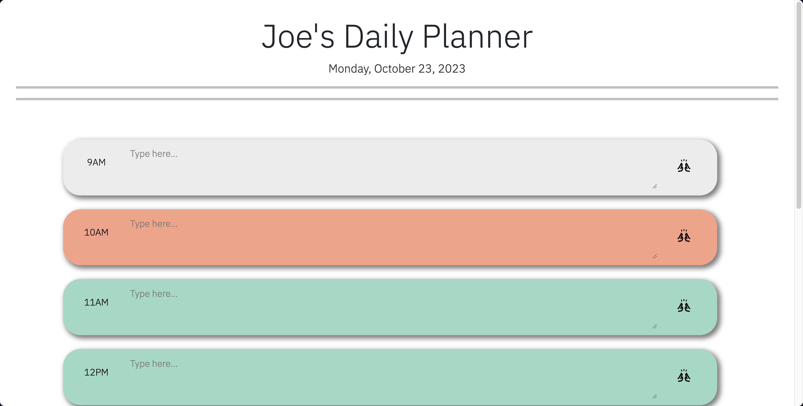
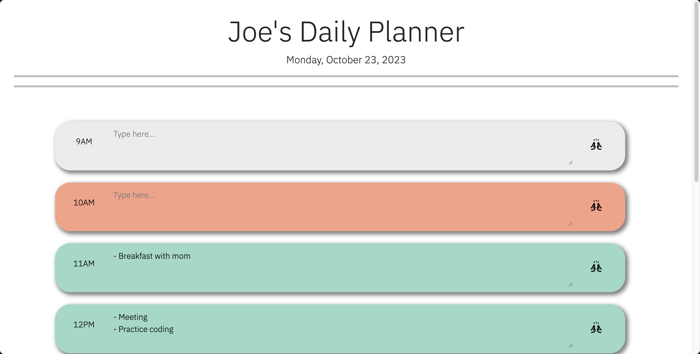

# Joe's Daily Planner

## Description

This is a daily planner application that allows a user to save events for each hour of the work day.

It uses jQuery and DayJS to dynamically update the UI and save/load data from localStorage.

Here is an overview of what it is doing:

- On page load, it gets the current date with DayJS and displays it in the header. 
- The colorCode() function loops through each timeblock, compares its ID to the current hour, and sets a color-coded class based on past/present/future.
- When the save button is clicked, it saves the input text to localStorage using the timeblock ID. 
- The loadSavedText() function retrieves any saved data from localStorage and sets the timeblock input values.
- colorCode() and loadSavedText() are called on page load to initialize the data and styling.
- colorCode() is also set on a 1 second interval to persistently update the styles as time passes.

This provides a simple daily planner interface and functionality using jQuery, DayJS, color-coding, and localStorage to handle the data.

## Usage

This simple calendar application allows the user to save events for each hour of the day.

To use this planner:

- The current day is displayed at the top of the calendar.
- Timeblocks for standard business hours are shown.
- Each timeblock is color coded to indicate whether it is in the past, present, or future.
- Click into a timeblock and enter an event.
- Click the save button for that timeblock to save the text in local storage.
- Saved events persist when the page is refreshed.
- The calendar automatically updates the timeblocks to change color based on the current time.

This app demonstrates use of jQuery, DayJS, color-coded classes, and localStorage to create a practical daily planner application. Timeblocks update in real-time to indicate the current hour and saved events stay in the user's browser.

## Screenshots

The following image demonstrates the web application's appearance and functionality:

## Deployment Link

https://jmlouf.github.io/joes-daily-planner/

## Credits

This project was created for educational purposes as part of the KU Coding Bootcamp curriculum.

The following resources were utilized:

- KU Coding Bootcamp Spot - Provided project requirements and guidelines.
- W3Schools - General reference for HTML, CSS and JavaScript.
- Bootstrap - Referenced for general CSS documentation.
- MDN Web Docs - Referenced for CSS styling and JavaScript documentation.
- Stack Overflow - Referenced for general JavaScript documentation.
- SheCodes - Referenced for past, present, and future color palettes.
- Google Fonts - Referenced for header/body font style and submit button icon.
- GeeksForGeeks - Referenced for automatic refreshing of JavaScript function.
- Tweek.so - Referenced for planner layout and style.

## License

Please refer to the LICENSE in the repository.